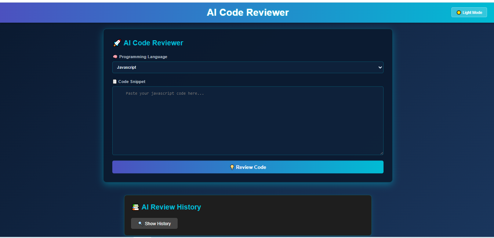
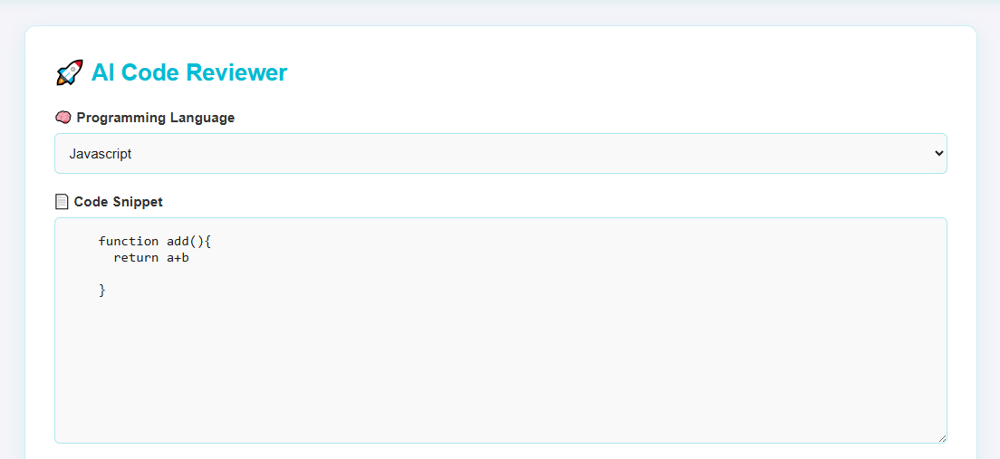
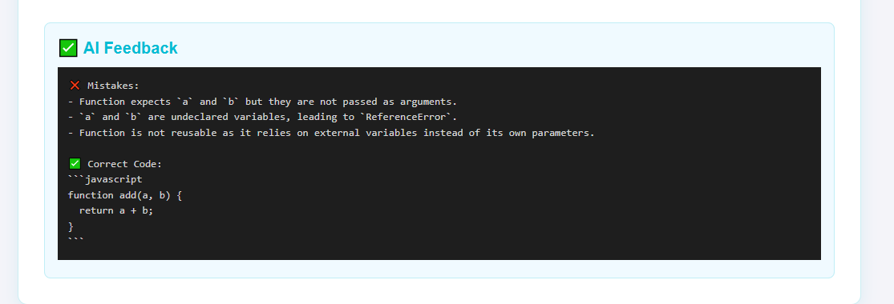
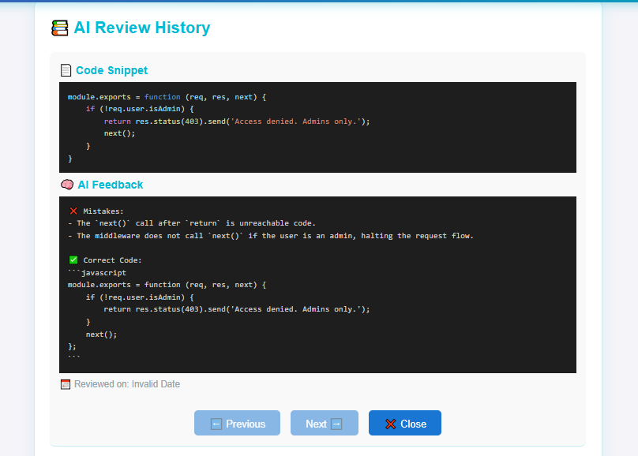

# 🎯 AI Code Reviewer — *Review Smarter, Not Harder!* 🤖💡

🚀 Say goodbye to tedious manual code reviews!  
**AI Code Reviewer** empowers developers by using **Google Gemini AI** to instantly generate expert-level code feedback.  
Whether you're learning, debugging, or optimizing — this tool has your back. 🧠✨

---

## ⚡ Key Features

- ✨ **Instant AI Code Reviews**
- 🧠 **Smart Language Detection**
- 💬 **AI Feedback with Detailed Suggestions**
- 🌐 **Multi-Language Support:** `JavaScript`, `Python`, `Java`, `C++`, `Ruby`
- 📜 **Full Review History with One-by-One Navigation**
- 🌗 **Dark/Light Mode Toggle**
- 📌 **Fixed Header for Seamless Navigation**
- 🧼 **Clean, Responsive UI**
- 💾 **MongoDB Integrated Storage**

---

## 🔥 Live Preview (Screenshots)

  
  
  
  
  

## 🌐 Live Demo

---

## 🛠️ Tech Stack

| ⚙️ Tech         | 📝 Description               |
|----------------|------------------------------|
| 🧠 Gemini API   | AI-generated code feedback   |
| ⚛️ React        | Frontend user interface      |
| 🧪 PrismJS      | Code syntax highlighting     |
| 🌍 Express.js   | Node-based backend API       |
| 🍃 MongoDB      | Document-based database      |
| 🎨 CSS          | Responsive theme styling     |

## Install dependencies
- cd Backend && npm install
- cd ../Frontend && npm install

# Create your .env in /Backend
- GOOGLE_GEMINI_KEY=your-api-key
- MONGO_URI=your-mongodb-uri

# 🧠 About the AI
- This project uses Google Gemini 2.5 Flash to:
- Review code for bugs, readability, and performance
- Provide secure and best practice suggestions
- Highlight language-specific improvements

# 🙌 Contributing
- Pull requests are welcome!
- If you want to add new languages or features, feel free to fork and submit a PR.

#  Author
Made with ❤️ by Suhail Ahmed — Learning, Building, and Sharing