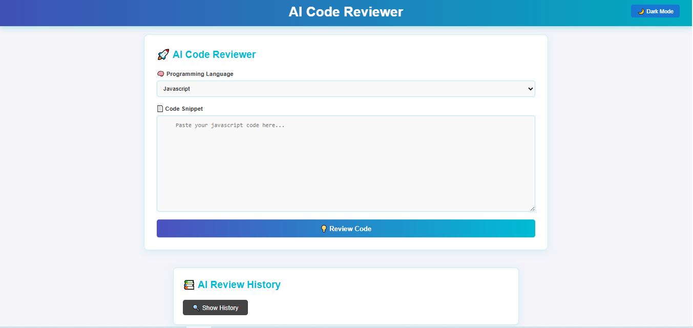

# 🎯AI Code Reviewer — Review Smarter, Not Harder!🤖💡

Say goodbye to hours of code reviews!  
**AI Code Reviewer** is a powerful tool that uses Google Gemini 🤖 to give instant, professional feedback on your code. Supports multiple languages, clean UI, dark/light mode, and full history tracking! 🎯

---

## 🚀 Features

✨ Instant AI Code Reviews  
🧠 Supports Multiple Languages: `JavaScript`, `Python`, `Java`, `C++`, `Ruby`  
📋 Smart Language Detection  
📜 Review History with Navigation  
🌗 Dark/Light Mode Toggle  
📌 Fixed Header for Seamless Experience  
🎯 Simple and Elegant UI  
💾 Save & Fetch from MongoDB

---

## 🔥 Demo Preview

### 👨‍💻 Code Editor

---

## 🛠️ Tech Stack

| Tech        | Description              |
|-------------|--------------------------|
| 🧠 Gemini API | AI content generation     |
| ⚛️ React     | Frontend SPA              |
| 🧪 PrismJS   | Code syntax highlighting |
| 🌍 Express.js | REST API backend         |
| 🍃 MongoDB   | NoSQL database            |
| 🎨 CSS       | Custom styling (Dark/Light) |
